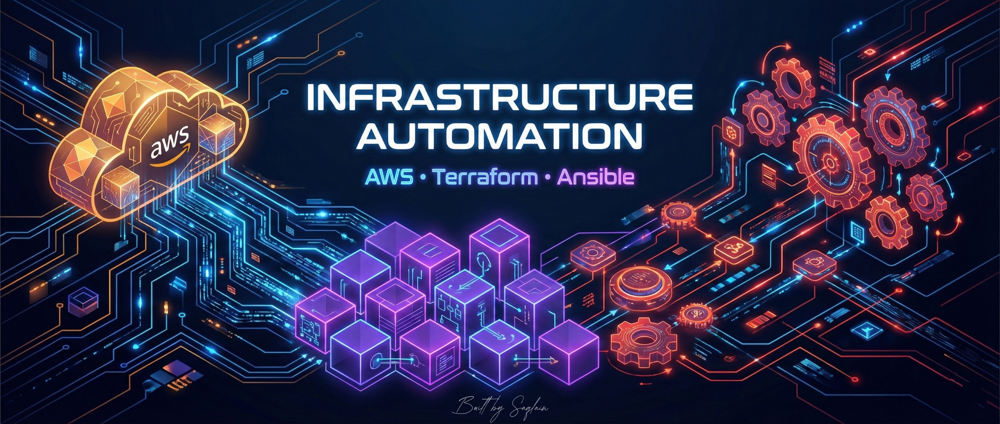
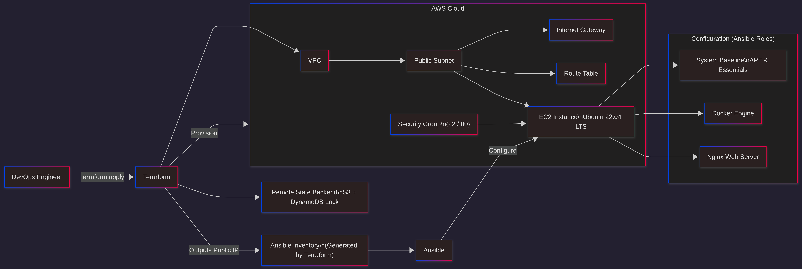

<p align="center">
  
  
  
  
</p>

# Infrastructure as Code (IaC) on AWS using Terraform & Ansible

## Project Overview

This project demonstrates a **production-style DevOps workflow** by implementing **Infrastructure as Code (IaC)** on the **AWS cloud**. Terraform is used to provision modular cloud infrastructure, while Ansible automates server configuration, enabling a fully automated, repeatable, and end-to-end web server deployment from network provisioning to application-ready configuration.

## Core Design Principles

- **Terraform** manages the infrastructure lifecycle (create, modify, destroy)
- **Ansible** manages server configuration (OS, packages, services)
- **Strict separation of concerns** between infrastructure and configuration
- **Idempotent automation** enabling safe re-runs
- **Remote state management** with locking for reliability

## Features
> <small>Industry-standard DevOps practices implemented</small>

- Infrastructure as Code (IaC)
- Modular Terraform design
- Remote state management with locking
- Configuration as Code
- Role-based Ansible architecture
- Idempotent automation
- Clear separation of responsibilities
- Cost-aware resource lifecycle management

## Technology Stack

| Category                  | Tools                   |
|---------------------------|-------------------------|
| Cloud Provider            | AWS                     |
| Infrastructure as Code    | Terraform (modular)     |
| Configuration Management  | Ansible (roles-based)   |
| Terraform State Management| S3 + DynamoDB           |
| Operating System          | Ubuntu 22.04 LTS        |

## Project Architecture

### Terraform Architecture
- Infrastructure provisioning (VPC, public subnet, networking)
- Compute provisioning (EC2 running Ubuntu 22.04 LTS)
- Security configuration (Security Groups: SSH 22, HTTP 80)
- Remote state management using S3 for state storage
- DynamoDB-based state locking for concurrency control and safe collaboration

### Automation Bridge (Terraform → Ansible)
- Terraform outputs the EC2 public IP
- Dynamic inventory file generated for Ansible consumption

### Configuration Layer (Ansible)
- System baseline configuration (APT updates and essential packages)
- Docker installation and configuration
- Nginx installation and service management
- Role-based, reusable Ansible architecture


## Architecture Diagram



## Repository Structure

```
iac-aws-terraform-ansible/
├── terraform/                 # Infrastructure provisioning
│   ├── modules/               # Reusable Terraform modules
│   │   ├── networking/        # VPC, subnet, routing
│   │   └── compute/           # EC2 resources
│   ├── provider.tf
│   ├── main.tf
│   ├── variables.tf
│   ├── outputs.tf
│   └── backend configuration
│
├── ansible/                   # Configuration management
│   ├── inventory/             # Terraform-generated inventory
│   ├── playbooks/             # Entry playbooks
│   ├── roles/                 # Modular roles
│   │   ├── common/             # System baseline
│   │   ├── docker/             # Docker installation
│   │   └── nginx/              # Nginx setup
│   └── ansible.cfg
│
└── README.md                  
```
## Author & Project Context

**Saqlain Sheikh**  
DevOps & Cloud Enthusiast  
AWS • Terraform • Ansible • Docker • Linux  

This project was developed as part of an internship at **Exposys Data Labs**, a software development company, to demonstrate practical implementation of **Infrastructure as Code (IaC)** for cloud environments.

This project was independently designed, implemented, and documented end-to-end by me. The objective was to address common challenges of manual cloud infrastructure setup—such as inconsistency, errors, and poor repeatability—by automating infrastructure provisioning and server configuration using Terraform and Ansible, following production-oriented DevOps best practices.

> **Note:** <small>
> To run this project, see the [Quick Start Guide](runbook.md).
> </small>

> **Note:** <small>
This project focuses on core infrastructure automation using Terraform and Ansible. 
It intentionally excludes scaling components (ASG, ALB), CI/CD pipelines, Kubernetes, 
and manual configuration to emphasize repeatable, idempotent provisioning and clean teardown.
</small>

<p align="center"><b>⭐ If you found this project useful, please star the repository!</b></p>
